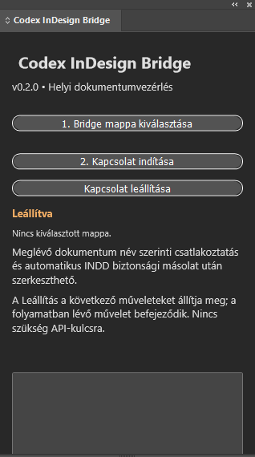
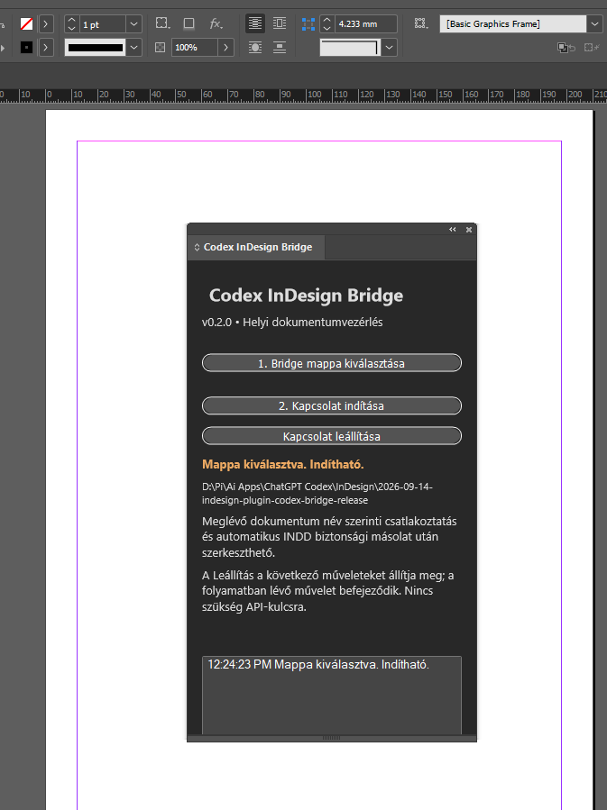

# Codex InDesign Bridge

Codex InDesign Bridge is a local, consent-based Adobe InDesign UXP panel that lets a trusted local Codex workflow inspect and automate an open InDesign session. It uses a user-selected folder and validated JSON requests; it does not run a network service and does not require an API key.

## Version and compatibility

- Current version: 0.3.0
- Host: Adobe InDesign 2023 (18.5) or later
- Development loader: Adobe UXP Developer Tool
- Client runtime: Node.js 18 or later
- Dependencies: none

## Key capabilities

- Prove a live session and list open documents before writing.
- Inspect page items and text content.
- Create bridge-owned documents, pages, layers, colors, text frames, and rectangles.
- Edit an existing document only after an explicit ID-and-name attachment creates an INDD backup.
- Place vetted local image assets.
- Save INDD or INDT copies and export PDF or IDML.

## Security model

The selected bridge folder is a trust boundary. Any local process able to write a request into that folder can command the active panel. Select a private folder, run non-mutating checks first, attach existing documents explicitly, inspect outputs, and stop the connection when finished.

The protocol rejects arbitrary code, file traversal, stale sessions, expired requests, and oversized batches. Requests that time out must not be resent blindly; inspect the correlated response file first.

## Install and use

The release download contains only the loadable plug-in, the local client needed to communicate with it, and the installation and usage guides:

- [Installation](INSTALL.md)
- [Usage](USAGE.md)
- [Download Codex-InDesign-Bridge-v0.3.0.zip](Downloads/Codex-InDesign-Bridge-v0.3.0.zip)
- [SHA-256 checksum](Downloads/Codex-InDesign-Bridge-v0.3.0.zip.sha256)

## Verification status

Automated protocol, client, and simulated executor checks passed for v0.3.0. The submitted screenshots show the panel loaded in InDesign, but this publishing session did not establish an active Bridge session; a live smoke test remains required before presenting a release as fully production-verified.

## Repository contents

The GitHub repository includes documentation and screenshots. The downloadable release asset is deliberately smaller: only the plug-in, client, INSTALL.md, and USAGE.md.

## License

Released under the [MIT License](LICENSE).
